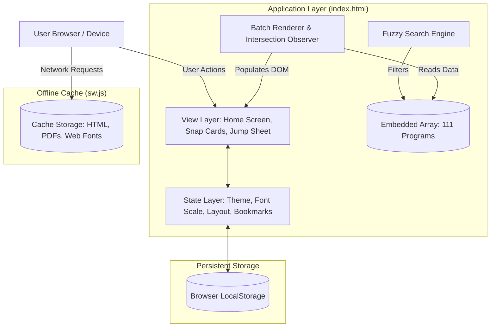
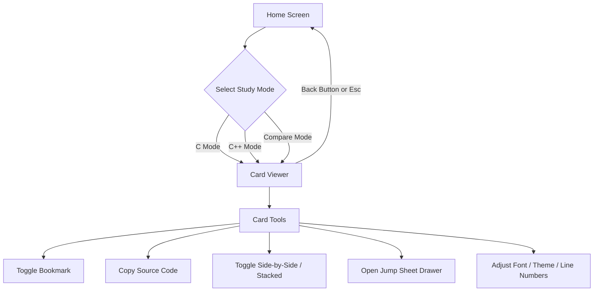
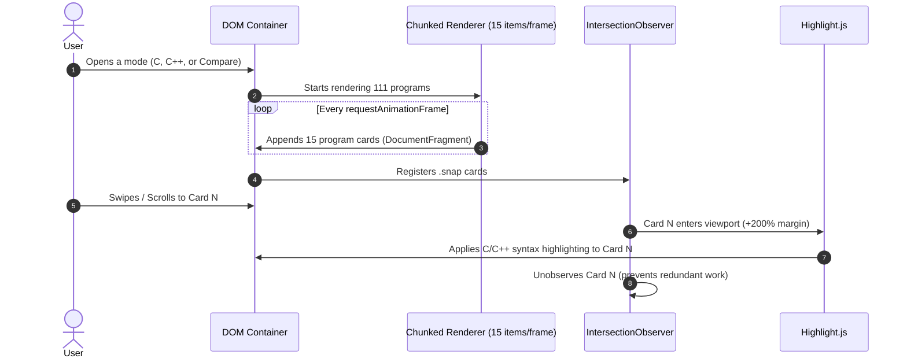

# DUET Code — C & C++ Programs

A dedicated, offline-first web application designed for diploma engineering students preparing for the DUET (Dhaka University of Engineering & Technology) admission test. It provides all 111 syllabus programs in C and C++, complete with side-by-side language comparison, Bengali logic breakdowns, instant search, and study tools.

---

## Table of Contents
- [Overview](#overview)
- [How It Works (Plain English)](#how-it-works-plain-english)
- [System Architecture & Data Flow](#system-architecture--data-flow)
- [Key Features](#key-features)
- [Technical Breakdown](#technical-breakdown)
  - [Zero-Build Single-File Architecture](#zero-build-single-file-architecture)
  - [Offline Support & Service Worker](#offline-support--service-worker)
  - [Rendering Performance (Chunked Batching)](#rendering-performance-chunked-batching)
  - [On-Demand Syntax Highlighting](#on-demand-syntax-highlighting)
  - [Fuzzy Search Algorithm](#fuzzy-search-algorithm)
  - [Theme System & Anti-Flash Mechanism](#theme-system--anti-flash-mechanism)
  - [Mobile Gestures & Viewport Handling](#mobile-gestures--viewport-handling)
- [Data Model](#data-model)
- [File Structure](#file-structure)
- [Running Locally](#running-locally)
- [Deployment](#deployment)

---

## Overview

DUET Code was created to solve a real student problem: studying and comparing C and C++ programs from fragmented PDF sheets on mobile devices is clumsy and requires continuous internet access.

This project packages the entire DUET admission programming syllabus into a fast, standalone web app that can be installed on any phone, tablet, or laptop and used without an internet connection.

---

## How It Works (Plain English)

Most modern websites rely on servers to render pages or send data on every click. If the user loses network connection, the site stops working.

DUET Code takes a self-contained approach:

1. **Embedded Data**: All 111 programs, their Bengali explanations, output demos, and both C and C++ implementations are stored in a single structured array inside the application.
2. **Local Caching**: On the first visit, a background Service Worker caches the HTML file, web manifest, downloaded fonts, and PDF notes. Subsequent visits load instantly from the browser cache without making network calls.
3. **Smooth Card Pagination**: Instead of a long, sluggish web page, programs are displayed as full-screen cards that snap into place as you swipe or scroll.
4. **Local State Persistence**: Bookmarks, current reading position, font size, layout selection, and themes are stored in `localStorage`, so users pick up right where they left off.

---

## System Architecture & Data Flow

### Architecture Diagram



### Application State & User Navigation



### Render & Highlight Pipeline



---

## Key Features

- **111 Complete Programs**: Covers all syllabus areas including arithmetic, control statements, loops, series summation, arrays, matrices, string operations, recursion, pointers, and ASCII pattern printing.
- **Three View Modes**: Dedicated C view, dedicated C++ view, and a dual comparison view.
- **Flexible Comparison Layout**: Switch between horizontal side-by-side columns and vertical stacked blocks depending on screen size.
- **Bengali Logic & Dry Runs**: Clarifies tricky problems, logic flow, sample inputs, and expected outputs in clear Bengali.
- **Fuzzy Search with Highlights**: Quickly find problems by keyword, number, or concept with matched terms highlighted in real time.
- **Jump Sheet Navigation**: Slide-up drawer on mobile and side drawer on desktop for direct jumping to any problem or filtered bookmarks.
- **Bookmark Management**: Star programs to create a personalized study list saved across browser sessions.
- **Resume Last Viewed**: Automatically tracks the last program viewed and allows one-tap resumption from the home screen.
- **Reading Customizations**: Light and dark mode, multiple color presets (Modern, Wood, Vibrant, Classic, Retro), adjustable font sizes, and line number toggles.
- **Offline PDF & APK Access**: One-click downloads for printable syllabus PDFs and a native Android APK build.

---

## Technical Breakdown

### Zero-Build Single-File Architecture
The application is built using standard HTML5, CSS3, and modern vanilla JavaScript without intermediate build tooling (Webpack, Vite, or Babel) or runtime UI libraries. This guarantees zero compilation overhead, rapid prototyping, and tiny asset footprints.

### Offline Support & Service Worker
The service worker (`sw.js`) manages caching using a Cache-First strategy:
- Static assets (`index.html`, `manifest.json`, and PDF files) are pre-cached during the `install` lifecycle event.
- Google Fonts requests (`fonts.googleapis.com` and `fonts.gstatic.com`) are dynamically intercepted and cached at runtime.
- A navigation fallback ensures that if an offline request occurs, `index.html` is returned seamlessly.

### Rendering Performance (Chunked Batching)
Injecting 111 comprehensive programs (which contain several thousand DOM nodes) all at once blocks the browser's main thread and drops animation frames. 

To maintain a steady 60 FPS:
1. The DOM builder splits the dataset into batches of 15 cards.
2. Each batch is constructed inside an in-memory `DocumentFragment`.
3. `requestAnimationFrame` schedules each batch on successive idle frames, keeping the UI responsive during initial transitions.

### On-Demand Syntax Highlighting
Highlighting all 111 code samples upon loading creates unnecessary CPU load:
1. The core `highlight.js` bundle is loaded asynchronously only when entering the reader view.
2. An `IntersectionObserver` with a `rootMargin` of `200% 0px` monitors card positions.
3. Code blocks are highlighted just before they enter the visible viewport.
4. Cards are unobserved immediately after highlighting to release memory.

### Fuzzy Search Algorithm
The search engine scores candidate programs through sequential character indexing:
- Matches are evaluated case-insensitively.
- Substring matches receive high priority scores.
- Scored results are sorted descending, capped to the top matches, and rendered with matching text wrapped in `<mark class="search-hl">`.

### Theme System & Anti-Flash Mechanism
To prevent Theme Flash (where a dark theme briefly flashes white on page load):
- An inline script in `<head>` immediately reads `duet-theme` and `duet-preset` from `localStorage` before the first paint occurs.
- The root `<html>` element is tagged with `data-theme` and `data-preset` before stylesheets calculate final layout values.
- All styles are parameterized via CSS custom properties (`--bg`, `--card`, `--text`, `--accent`, `--border`).

### Mobile Gestures & Viewport Handling
- **Viewport Height Stability**: On mobile browsers, showing or hiding address bars causes viewport jump. A custom script dynamically calculates `--vh` on window resize to stabilize container dimensions.
- **Scroll Snap**: Native CSS `scroll-snap-type: y mandatory` provides smooth card-to-card paging without heavy JavaScript touch-drag listeners.
- **Swipe-to-Dismiss Sheet**: A dedicated touch handler on the bottom sheet handle allows natural downward flick gestures to close the drawer.
- **Haptic Feedback**: Integrates `navigator.vibrate` for subtle tactile responses on bookmark clicks, copy actions, and navigation triggers.

---

## Data Model

The data layer lives inside `index.html` as a structured array of 4-element tuples:

```javascript
const data = [
  [
    /* Index 0: Problem Title & Number */
    "01. SUM, SUBTRACTION, MULTIPLICATION & DIVISION OF TWO NUMBERS",

    /* Index 1: Logic, Notes, Bengali Explanation, Output */
    `নমুনা আউটপুট:
  Enter two numbers: 10 3
  Sum = 13.000000, Subtraction = 7.000000
  Multiplication = 30.000000, Division = 3.333333
  b=0 হলে → "Division not possible" প্রিন্ট হবে।`,

    /* Index 2: C Source Code */
    `#include <stdio.h>

int main() {
    float a, b;
    printf("Enter two numbers: ");
    scanf("%f %f", &a, &b);
    printf("Sum = %f\\n", a + b);
    printf("Subtraction = %f\\n", a - b);
    printf("Multiplication = %f\\n", a * b);
    if (b != 0)
        printf("Division = %f\\n", a / b);
    else
        printf("Division not possible (b=0)\\n");
    return 0;
}`,

    /* Index 3: C++ Source Code */
    `#include <iostream>
using namespace std;

int main() {
    float a, b;
    cout << "Enter two numbers: ";
    cin >> a >> b;
    cout << "Sum = " << a + b << endl;
    cout << "Subtraction = " << a - b << endl;
    cout << "Multiplication = " << a * b << endl;
    if (b != 0)
        cout << "Division = " << a / b << endl;
    else
        cout << "Division not possible (b=0)" << endl;
    return 0;
}`
  ],
  // Remaining 110 programs follow the same structure...
];
```

---

## File Structure

```text
C-Cpp-Basic-programmes/
├── index.html                      # Main entrypoint: UI, styling, runtime logic, and program dataset
├── manifest.json                   # Web application manifest for PWA installation
├── sw.js                           # Service worker handling offline caching
├── vercel.json                     # Production HTTP headers, caching headers, and security rules
├── package.json                    # Project metadata
├── programs.txt                    # Plain text index of the 111 syllabus programs
├── DUET Admission C.pdf            # PDF copy: C admission programs
├── DUET Admission Cpp.pdf          # PDF copy: C++ admission programs
├── DUET C & C++ Programs.pdf       # PDF copy: Combined C & C++ admission booklet
├── duet-admission-c-programs.pdf   # Companion C reference document
├── duet-admission-cpp-programs.pdf # Companion C++ reference document
└── scripts/
    └── copy-assets.js              # Build asset distribution script
```

---

## Running Locally

Because this project relies strictly on native web technologies, no build tools or package installations are mandatory:

1. Clone the repository:
   ```bash
   git clone https://github.com/humayunk45423/C-Cpp-Basic-programmes.git
   ```
2. Open `index.html` directly in any web browser.
3. If you wish to test Service Worker caching and PWA installation features, run any local web server:
   ```bash
   # Using Python 3
   python -m http.server 8000

   # Or using Node.js
   npx serve .
   ```

---

## Deployment

The repository is pre-configured for static hosting platforms like Vercel, Netlify, GitHub Pages, or Cloudflare Pages.

- `vercel.json` contains security headers (`X-Frame-Options: DENY`, `X-Content-Type-Options: nosniff`, `X-XSS-Protection`) and enforces long-term immutable caching on PDF assets.
- For GitHub Pages, enable Pages in the repository settings and point the source branch to `main`.

---

## Author

- **Developer**: [Humayun Kobir](https://github.com/humayunk45423)
- **Live Website**: [DUET Code](https://duetcode.vercel.app)
- **GitHub**: [humayunk45423](https://github.com/humayunk45423)
